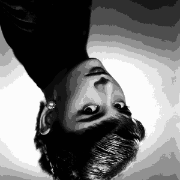
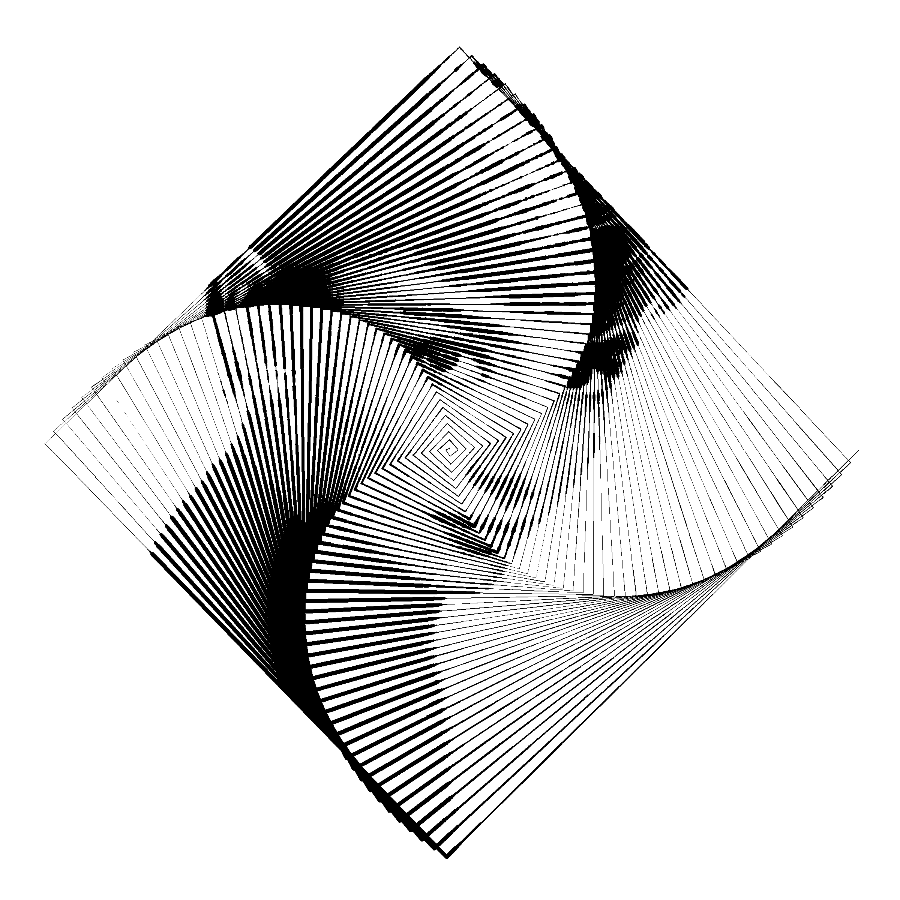

<!-- README.md is generated from README.Rmd. Please edit that file -->

# Photos on spirals

## Introduction

-   A while ago I saw an example of a cool effect where a photo was
    recreated on a single line spiral. The image was rendered by the
    spiral line getting thicker (to create darker areas) and thinner (to
    create lighter areas).
-   I can’t find the original example I saw, but I have since found this
    website <https://spiralbetty.com/> - which seems to do the same
    thing in a really nice way!
-   So this is my attempt at a janky implementation of this effect in R
    using spatial intersections, driven by the `{sf}` package
    -   This implementation doesn’t create a truly continuous single
        line image, but rather sections that are plotted with different
        thickness values
    -   This code is inefficient and could contain errors - its just for
        fun to try and create these images!

``` r
library(magick)
library(sf)
library(tidyverse)
```

## Read an image

-   Read a test image. I choose Audrey!

``` r
i <- 
  image_read('https://images.photowall.com/products/59143/audrey-hepburn-3.jpg?h=699&q=85') |> 
  image_resize("300x")

i
```


## Process image

-   Crop it square
-   Convert it to greyscale
-   Reduce the number of grey shades
-   Flip it to be upside down (more on this later!)

``` r
# Define some variables for this step
size <- 300
n_shades <- 16

i_processed <-
  i |>
  image_resize(paste0(size,"x",size,"^")) |>
  image_crop(geometry = paste0(size,"x",size), gravity = "center") |>
  image_convert(type = "grayscale") |>
  image_quantize(max = n_shades, dither=FALSE) |>
  image_flip()
  
i_processed
```



## Convert image to polygons

-   Convert the image to a dataframe
-   Extract the red green and blue values for each pixel (they’re the
    same as I previously converted the image to greyscale)
-   Rescale the red channel (could be done with green or blue) to be
    between 1 and 0
-   Convert the dataframe to a `{stars}` raster object
-   Convert the `{stars}` raster to an `{sf}` polygon set merging cells
    with identical values
-   Make the polygons valid and normalise to be between 0 and 1 (this
    works because I cropped the image to be square originally)
-   This whole step feels clunky. I’d love to know if there is a more
    efficient/elegant way of converting an image raster to a set of
    polygons

``` r
i_sf <- 
  i_processed |> 
  image_raster() |> 
  mutate(
    col2rgb(col) |> t() |> as_tibble(),
    col = scales::rescale(red, to = c(1,0))) |> 
  select(-green, -blue, -red) |> 
  stars::st_as_stars() |> 
  st_as_sf(as_points = FALSE, merge = TRUE) |> 
  st_make_valid() |> 
  st_set_agr("constant") |> 
  st_normalize()
```

-   Visualise the `{sf}` polygons
-   Notice that the image is not plotting upside down (this is because
    we flipped it earlier)
    -   It would of course be possible to reverse the y axis instead -
        but then this will cause problems when adding other (non
        inverted) layers to the plot

``` r
ggplot() + 
  geom_sf(data = i_sf, col = NA, aes(fill = col)) + 
  scale_fill_viridis_c(direction = -1)
```

<!-- -->

## Generate spiral

-   A function for a parameterised spiral that I cobbled together from
    various online sources and some of my own ropey maths
-   This is probably not great but works well enough for this project

``` r
#' Create spiral coordinates
#'
#' @param xo Spiral origin x coordinate
#' @param yo Spiral origin y coordinate
#' @param n_points Number of points on whole spiral (equally spaced in angle)
#' @param n_turns Number of turns in spiral
#' @param r0 Spiral inner radius
#' @param r1 Spiral outer radius
#' @param offset_angle Offset angle for start of spiral (in degrees)
spiral_coords <- function(xo, yo, n_points, n_turns, r0, r1, offset_angle){

  b <- (r1 - r0)/(2*pi*n_turns)
  l <- seq(0, 2*pi*n_turns, l=n_points)

  tibble(
    x = (r0 + (b*l))*cos(l + offset_angle*(pi/180)) + xo,
    y = (r0 + (b*l))*sin(l + offset_angle*(pi/180)) + yo)
}
```

-   Define some parameters for the spiral
-   Create the spiral coordinates and convert it to an `{sf}` linestring

``` r
n_turns <- 50
spiral_r1 <- 0.5

spiral <-
    spiral_coords(
      xo = 0.5,
      yo = 0.5,
      n_points = 5000,
      n_turns = n_turns,
      r0 = 0,
      r1 = spiral_r1,
      offset_angle = 0) |>
    as.matrix() |>
    sf::st_linestring()
```

-   Visualise the `{sf}` spiral and image polygons as a sense check that
    they align

``` r
ggplot()+
  geom_sf(data = i_sf, aes(fill = col), col = NA) +
  geom_sf(data = spiral, col = "black") +
  scale_fill_viridis_c("", alpha = 0.75, direction = -1)+
  theme(legend.position = "")
```

<!-- -->

## Compute spiral - image interscetions

-   Compute the minimum `thin` and maximum `thick` amount to buffer the
    intersections by
    -   The `thick` value is set to be 95% of the gap between the spiral
        lines (so it will always scale appropriately)
-   Compute image spiral intersections
-   Rescale the greyscale value to be between `thick` and `thin` so that
    darker shades are closer to `thick` and lighter shades are closer to
    `thin`
-   Buffer the intersections by their scaled greyscale values

``` r
thin <- 0.00025
thick <- ((spiral_r1/n_turns)/2)*0.95

intersections <-
    st_intersection(i_sf, spiral) |>
    mutate(n = scales::rescale(col, to=c(thin, thick))) |>
    mutate(geometry = st_buffer(geometry, n, endCapStyle = "ROUND"))
```

-   Visualise the spiral image

``` r
ggplot() + geom_sf(data = intersections, fill = "black", col = NA)
```

<!-- -->

-   The colour can also be mapped to the colour shade - but this will
    ruin the illusion of a continuous line
-   I arrange the data by the thickness value descending prior to
    plotting so that the thinner lines are plotted on top of the thicker
    ones and don’t get lost

``` r
ggplot() + 
  geom_sf(
    data = intersections |> arrange(desc(n)), 
    aes (fill = n),
    col = NA) +
  scale_fill_gradient(low = "white", high = "black")+
  theme_void()+
  theme(legend.position = "")

ggplot() + 
  geom_sf(
    data = intersections |> arrange(desc(n)), 
    aes (fill = n),
    col = NA) +
  scale_fill_viridis_c(direction = -1, option = "plasma")+
  theme_void()+
  theme(legend.position = "")
```


-   A single polygon of the spiral can be made with `st_union()`. The
    boundary linestring could also be returned afterwards by using
    `st_boundary()`

``` r
ggplot() + geom_sf(data = intersections |> st_union(), col = 1, fill = "red")
last_plot() + coord_sf(xlim = c(0.4, 0.6), ylim = c(0.4, 0.6))
```


## Create a function

-   Put together a function that runs the code above, with some small
    additions
    -   The ability to invert the image
    -   Control the outer spiral radius by a factor `spiral_r1_f` where
        a value of 1 takes it to the edge of the image
    -   Parameterise the spiral max thickness with a factor `thick_f`
        where a value of 1 should make the spiral touch in the thickest
        areas
-   Note that this function also calls the `spiral_cords()` function
    defined above

``` r
spiral_image <-
  function(
    img,
    invert = FALSE,
    size = 300,
    n_shades = 16,
    spiral_points = 5000,
    spiral_turns = 50,
    spiral_r0 = 0,
    spiral_r1_f = 1,
    thin = 0.00025,
    thick_f = 0.95,
    spiral_offset_angle = 0,
    col_line = "black",
    col_bg = "white"){
    
    # Read image --------------------------------------------------------------
    if(class(img) == "magick-image"){i <- img} else {i <- magick::image_read(img)}
    
    # Process image to sf polygon
    i_sf <-
      i |>
      magick::image_resize(paste0(size,"x",size,"^")) |>
      magick::image_crop(geometry = paste0(size,"x",size), gravity = "center") |>
      magick::image_convert(type = "grayscale") |>
      magick::image_quantize(max = n_shades, dither=FALSE) |>
      magick::image_flip() |> 
      magick::image_raster() |>
      dplyr::mutate(
        col2rgb(col) |> t() |> as_tibble(),
        col = scales::rescale(red, to = if(invert){c(0,1)}else{c(1, 0)})) |> 
      dplyr::select(-green, -blue, -red) |> 
      stars::st_as_stars() |>
      sf::st_as_sf(as_points = FALSE, merge = TRUE) |>
      sf::st_make_valid() |>
      sf::st_set_agr("constant") |> 
      sf::st_normalize()
    
    # Generate spiral ----------------------------------------------------------
    spiral <-
      spiral_coords(
        xo = 0.5,
        yo = 0.5,
        n_points = spiral_points,
        n_turns = spiral_turns,
        r0 = spiral_r0,
        r1 = 0.5 * spiral_r1_f,
        offset_angle = spiral_offset_angle) |>
      as.matrix() |>
      sf::st_linestring()
    
    # Compute the thick value
    thick <- ((((0.5*spiral_r1_f) - spiral_r0)/spiral_turns)/2)*thick_f
    
    intersections <-
      sf::st_intersection(i_sf, spiral) |>
      dplyr::mutate(n = scales::rescale(col, to=c(thin, thick))) |>
      dplyr::mutate(geometry = sf::st_buffer(geometry, n, endCapStyle = "ROUND")) |>
      sf::st_union()
    
    ggplot2::ggplot() + 
      ggplot2::geom_sf(data = intersections, fill = col_line, col = NA)+
      ggplot2::theme_void()+
      ggplot2::theme(panel.background = ggplot2::element_rect(fill = col_bg, colour = NA))+
      ggplot2::scale_x_continuous(limits = c(0,1))+
      ggplot2::scale_y_continuous(limits = c(0,1))
  }
```

-   Some examples

``` r
spiral_image(i)
spiral_image(i, invert = TRUE)
spiral_image(i, col_bg = "grey20", col_line = "hotpink", invert = TRUE)
spiral_image(i, spiral_r0 = 0.1)
```


-   Some interesting effects can be achieved by setting the
    `spiral_turns` to be specific fractions of `spiral_points`

``` r
spiral_image(i, spiral_points = 150, spiral_turns = 50, thick_f = 0.5)

spiral_image(i, spiral_points = 200, spiral_turns = 50, thick_f = 0.5)
spiral_image(i, spiral_points = 200, spiral_turns = 50, thick_f = 0.5, spiral_offset_angle = 45)

spiral_image(
  i, 
  spiral_points = 250, 
  spiral_turns = 50, 
  invert = TRUE, 
  col_bg = "grey10", 
  col_line = "cyan", 
  thick_f = 0.5)
```



## Double image on spiral

-   One last experiment
-   Using the ability in `st_buffer()` to buffer only one side of the
    spiral line, it’s possible to render two images on the same spiral
-   Here I read a second image of audrey

``` r
i2 <- 
  magick::image_read('https://images.photowall.com/products/59144/audrey-hepburn-in-breakfast-at-tiffanys-1.jpg?h=699&q=85') |> 
  magick::image_resize("300x")

i2
```


-   Process the image as before
-   When it comes to the intersections, I buffer one with positive
    values and one with negative values and set `singleSide = TRUE`
    -   It doesn’t look like the `endCapStyle = "ROUND"` works for me
        when buffering on a single side…
-   Then visualise both sets of intersections with different colours
-   The fact that we normalised the `{sf}` polygon images to be between
    0 and 1 makes this fairly trivial

``` r
i2_sf <-
  i2 |> 
  image_resize(paste0("300x300^")) |>
  image_crop(geometry = paste0("300x300"), gravity = "center") |>
  image_convert(type = "grayscale") |>
  image_quantize(max = 16, dither=FALSE) |>
  image_flip() |> 
  image_raster() |>
  mutate(
    col2rgb(col) |> t() |> as_tibble(),
    col = scales::rescale(red, to = c(1, 0))) |> 
  select(-green, -blue, -red) |> 
  stars::st_as_stars() |>
  st_as_sf(as_points = FALSE, merge = TRUE) |>
  st_set_agr("constant") |> 
  st_normalize() |> 
  st_make_valid()

intersections_1 <-
  st_intersection(i_sf, spiral) |>
  mutate(n = scales::rescale(col, to=c(thin, thick))) |>
  mutate(geometry = st_buffer(geometry, n, singleSide = TRUE))

intersections_2 <-
  st_intersection(i2_sf, spiral) |>
  mutate(n = scales::rescale(col, to=c(thin, thick))) |>
  filter(st_geometry_type(geometry) != "POINT") |> # need to remove these for a negative buffer(?)
  mutate(geometry = st_buffer(geometry, -n, singleSide = TRUE))

ggplot() + 
  geom_sf(data = intersections_1, fill = 2, col = NA)+
  geom_sf(data = intersections_2, fill = 4, col = NA)
```

<!-- -->

``` r
last_plot() + coord_sf(xlim = c(0.3, 0.7), ylim = c(0.3, 0.7))
```

<!-- -->

## Beyond spirals

-   Of course this method lends itself to any shapes being used (not
    just spirals)

### Grids

-   Here’s a very quick look at using a grid of squares or hexagons
    instead using `st_make_grid()`
    -   Just using the same values of `thin` and `thick` as before. This
        should be changed

``` r
square_grid <- st_make_grid(i_sf, n = 50, square = TRUE) |> st_boundary() |> st_union()

intersections <-
  st_intersection(i_sf, square_grid) |>
  mutate(n = scales::rescale(col, to=c(thin, thick))) |>
  mutate(geometry = st_buffer(geometry, n, endCapStyle = "ROUND"))

ggplot() + geom_sf(data = intersections, fill = 1, col = NA)
```

<!-- -->

``` r
hex_grid <- st_make_grid(i_sf, n = 50, square = FALSE) |> st_boundary() |> st_union()

intersections <-
  st_intersection(i_sf, hex_grid) |>
  mutate(n = scales::rescale(col, to=c(thin, thick))) |>
  mutate(geometry = st_buffer(geometry, n, endCapStyle = "ROUND"))

ggplot() + geom_sf(data = intersections, fill = 1, col = NA)
```

<!-- -->

### Flow field

-   I’ve modified some code from my [flow field art(?)
    repo](https://github.com/cj-holmes/flow-field-art) to create a set
    of LINESTRINGs across a flow field
-   This is just a quick proof of concept

``` r
set.seed(4)

# Set dimensions for noise generation
x_side <- 400
y_side <- 400

# Create a noise field matrix with the {ambient} package
m <- 
  ambient::noise_simplex(
    c(y_side, x_side),
    frequency = 0.0003,
    octaves = 1,
    pertubation = "normal",
    pertubation_amplitude = 2,
    fractal = 'billow') |> 
  scales::rescale(c(-90, 90)) # scale noise values to angles in degrees (-90 to 90)

# Get the coords of flow line across the angle matrix
ff_polys <- function(
    x_start, 
    y_start, 
    step_length, 
    n_steps, 
    angle_matrix){
  
  # Initialise vectors with the starting x and y values filled with NAs
  out_x <- c(x_start, rep(NA, n_steps))
  out_y <- c(y_start, rep(NA, n_steps))
  
  # If the starting point is outside the angle_matrix dimensions, return NULL
  if(x_start > ncol(angle_matrix) |
     x_start < 1 |
     y_start > nrow(angle_matrix) |
     y_start < 1){
    return(NULL)
  }
  
  # Loop through each step as we travel across the angle matrix
  for(i in 1:n_steps){
  
    # Get the angle of the nearest flow field point where we are for this iteration
    a <- angle_matrix[round(out_y[i]), round(out_x[i])]
    
    # Compute how far to move in x and y for the given angle and step_length
    step_x <- cos(a*(pi/180))*step_length
    step_y <- sin(a*(pi/180))*step_length
    
    # Add the distance in x and y to the current location
    next_x <- out_x[i] + step_x
    next_y <- out_y[i] + step_y
    
    # If the next point in the path sits outside the angle matrix, stop iterating along the path
    if(next_x > ncol(angle_matrix) |
       next_x < 1 |
       next_y > nrow(angle_matrix) |
       next_y < 1){
      break
    }
    
    # Append the new x and y location to the output 
    # (ready to be used as the starting point for the next step iteration)
    out_x[i+1] <- next_x
    out_y[i+1] <- next_y
  }
  
  # Return tibble of the x, y, paths
  tibble(x = out_x, y = out_y) |> filter(!is.na(x), !is.na(y))
}

# Define number of points for flow lines to start at
n <- 800

# Re assign thick and thin
thin <-  0.0001
thick <- 0.0025

# Compute the flow line LINESTRINGs
ff <-
  tibble(
    x_start = runif(n, 1, ncol(m)),
    y_start = runif(n, 1, nrow(m)))  |> 
  mutate(
    id = row_number(),
    step_length = 1,
    n_steps = 400) |> 
  mutate(
    paths = pmap(
      .l = list(x_start = x_start,
                y_start = y_start,
                step_length = step_length,
                n_steps = n_steps),
      .f = ff_polys,
      angle_matrix = m)) |> 
  unnest(cols=paths) |> 
  st_as_sf(coords = c("x", "y")) |> 
  group_by(id) |> 
  summarise() |>
  mutate(type = st_geometry_type(geometry)) |> 
  filter(type == "MULTIPOINT") |> 
  st_cast("LINESTRING") |> 
  st_union() |>
  st_normalize()

# Compute intersections and plot
intersections <-
  st_intersection(i_sf, ff) |>
  mutate(n = scales::rescale(col, to=c(thin, thick))) |>
  mutate(geometry = st_buffer(geometry, n, endCapStyle = "ROUND"))

ggplot() + geom_sf(data = intersections, fill = 1, col = NA)
```

<!-- -->
